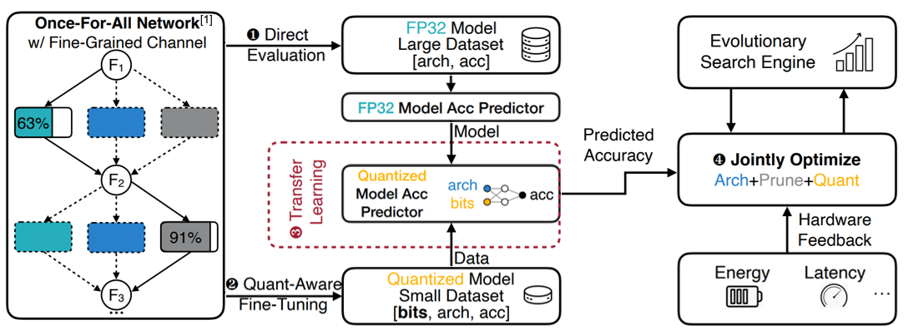
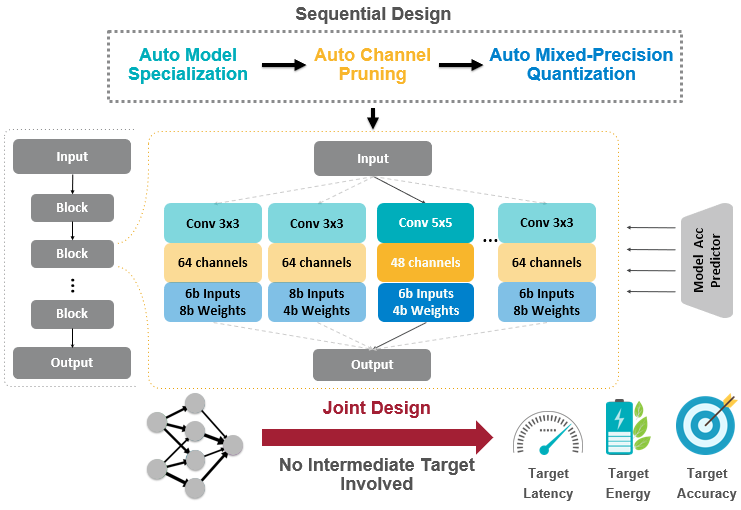
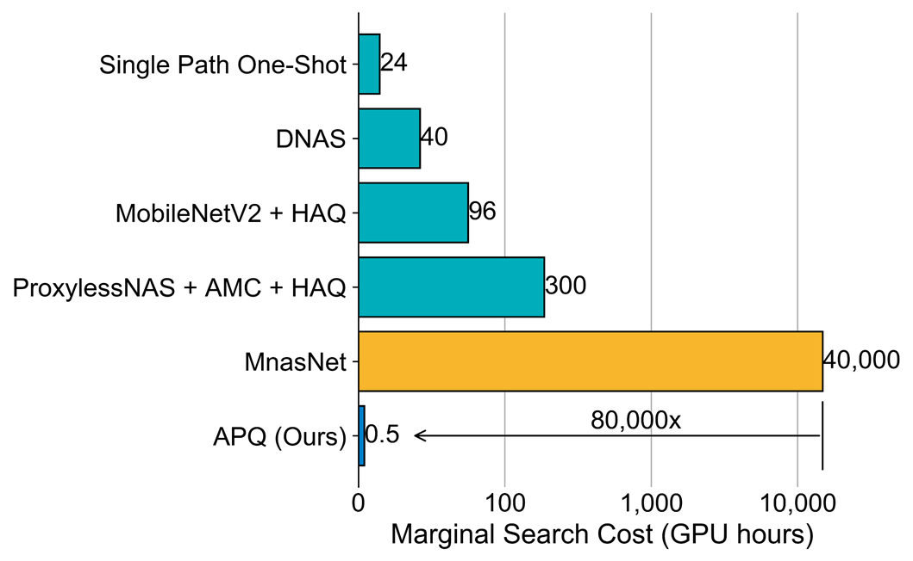
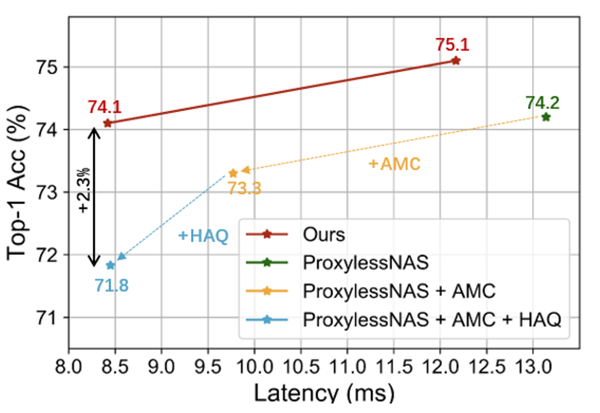

# APQ: Joint Search for Nerwork Architecture, Pruning and Quantization Policy
```
@inproceedings{Wang2020APQ,
  title={APQ: Joint Search for Nerwork Architecture, Pruning and Quantization Policy},
  author={Tianzhe Wang and Kuan Wang and Han Cai and Ji Lin and Zhijian Liu and Song Han},
  booktitle={Proceedings of the IEEE/CVF Conference on Computer Vision and Pattern Recognition},
  year={2020}
}
```
## Overview
We release the PyTorch code for the APQ. [[Paper](https://arxiv.org/pdf/2006.08509.pdf)|[Video](https://www.youtube.com/watch?v=s5v23hTe60s)|[Competition](https://github.com/mit-han-lab/lpcvc)]:
<p align="center">
  
</p>

### Jointly Search for Optimal Model
<p align="center">
  
</p>

### Save Orders of Magnitude Searching Cost 
<p align="center">
  
</p>

### Better Performance than Sequential Design
<p align="center">
  
</p>


## How to Use
### Prerequisites
    - Pytorch version >= 1.0
    - Python version >= 3.6
    - Progress >= 1.5
    - For getting new models, you'll need the NVIDIA GPU

### Dataset and Model Preparation
- Download [ImageNet dataset](http://www.image-net.org/) and put it into **dataset/imagenet**.
- Download checkpoints for [quantization-aware predictor](https://drive.google.com/file/d/1onIxkfLF-QCxi9YxzwQt6SpAaYNJBUDs/view?usp=sharing) and [once-for-all network](https://drive.google.com/file/d/1k9tv1ISsB-QDENspiuR82rDvaIYGIKD5/view?usp=sharing), put them into **models** folder.

### Codebase Structure
```
apq
- dataset (imagenet data path)
- elastic_nn (super network builder , w/ or w/o quantization)
    - modules (define the layers, w/ or w/o quantization)
    - networks (define the networks, w/ or w/o quantization)
    utils.py (some utility functions for elastic_nn folder)
- models (quantzation-aware predictor and once-for-all network checkpoint path)
- imagenet_codebase (training codebase for imagenet)
- lut (latency lookup table path)
- methods (methods to find the mixed-precision network)
    - evolution (evolution search code)
- utils (some utility functions, including converter)
    accuracy_predictor.py (construction of accuracy predictor)
    latency_predictor.py (construction of latency predictor)
    converter.py (encode a subnetwork in to 1-hot vector)
    quant-aware.py (code for quantization-aware training)
main.py
Readme.md
```

### Testing
For instance, if you want to test the model under *exps/test* folder.

Run the following command:
``` bash
CUDA_VISIBLE_DEVICES=0,1,2,3 python test.py \
    --exp_dir=exps/test
```
You will get the exact information (latency/energy) running on BitFusion platform and ImageNet Top-1 accuracy.
### Example
#### Evolution search
For instance, if you want to search a model under *12.80ms* latency constraint.

Run the following command: 
``` bash
CUDA_VISIBLE_DEVICES=0 python search.py \
    --mode=evolution \
    --acc_predictor_dir=models \
    --exp_name=test \
    --constraint=12.80 \
    --type=latency
```
You will get the candidate under the resource constraints (latency or energy), which is stored in *exps/test* folder.
#### Quantization-aware finetune on imagenet
For instance, if you want to quantization-aware finetuning for the model under *exps/test* folder.

Run the following command: 
``` bash
CUDA_VISIBLE_DEVICES=0,1,2,3 python quant_aware.py \
    --exp_name=test
```
You will get a mixed-precision model under the resource constraints (latency or energy) with considerable performance.

## Models
We provide the checkpoints for our APQ reported in the paper:
| Latency | Energy | BitOps | Accuracy | Model
| :--:|:--:|:--:|:--:|:--:|
|6.11ms|**9.14mJ**|12.7G|72.8%|[download](https://drive.google.com/drive/folders/1qcdtJVXMl1eo12MkNUFWcqNAJjknHrQq?usp=sharing)
|8.45ms|**11.81mJ**|14.6G|73.8%|[download](https://drive.google.com/drive/folders/1Dnm8Id7ANVe3uoqfbIw6NqJFmx97pHHq?usp=sharing)
|**8.40ms**| 12.18mJ | 16.5G|74.1%|[download](https://drive.google.com/drive/folders/1N1UBOcNWQQc4cPOchfgUu518OBXy94LP?usp=sharing)
|**12.17ms**|14.14mJ|23.6G|75.1%|[download](https://drive.google.com/drive/folders/1--H3JbV50elbjRlwix1-cMAQvRwxLHDy?usp=sharing)

You can download the models and put it into **exps** folder to test the performance.
Note that the **bold** item means the search under that constraint. 

## Related work on automated model compression and acceleration:

[Once for All: Train One Network and Specialize it for Efficient Deployment](https://arxiv.org/abs/1908.09791) (ICLR'20, [code](https://github.com/mit-han-lab/once-for-all))

[ProxylessNAS: Direct Neural Architecture Search on Target Task and Hardware](https://arxiv.org/pdf/1812.00332.pdf) (ICLR’19)

[AMC: AutoML for Model Compression and Acceleration on Mobile Devices](https://arxiv.org/pdf/1802.03494.pdf) (ECCV’18)

[HAQ: Hardware-Aware Automated Quantization](https://arxiv.org/pdf/1811.08886.pdf)  (CVPR’19, oral)
	
[Defenstive Quantization: When Efficiency Meets Robustness](https://openreview.net/pdf?id=ryetZ20ctX) (ICLR'19)
